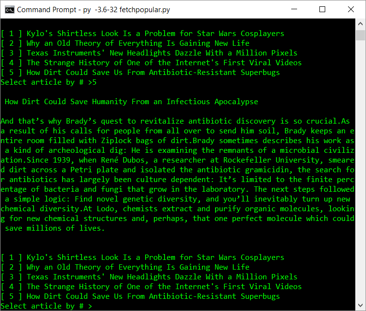
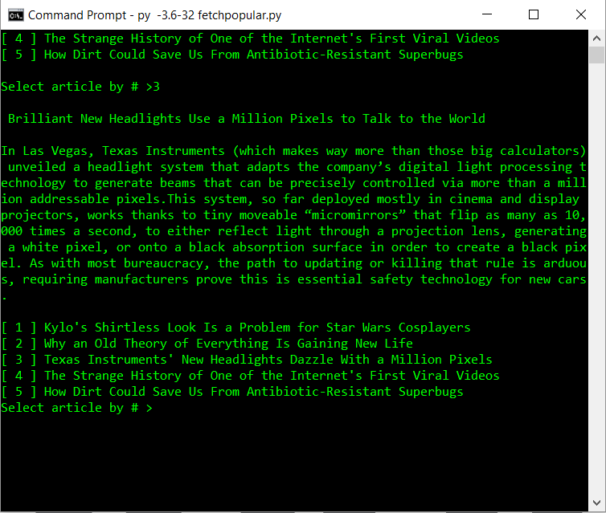

# WIREDSummarizer
Little Python program for fetching and summarizing the most popular articles from Wired.com!

Created using TextRank (note forked version contains faster levenshtein distance calculation; or else program crippled)

__Note: WIRED subscriptions will impact this program's ability to function well!__

Python 3.6
Dependencies: BeautifulSoup4, TextRank (slightly modified version including EditDistance)

**Screenshots:**

###### Summarized Version of 'How Dirt Could Save Us From Antibiotic-Resistant Superbugs' by Peter Smith from WIRED

###### Summarized Version of 'Texas Instruments' New Headlights Dazzle With a Million Pixels' by Eric Adams from WIRED

